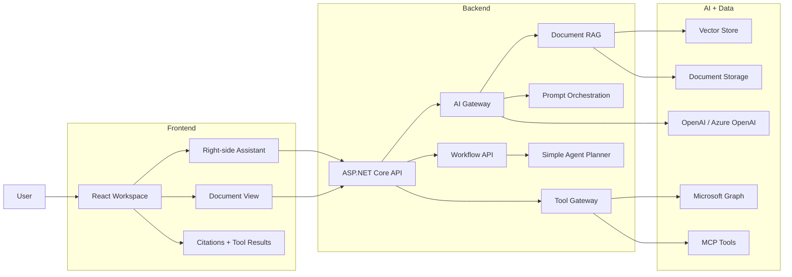
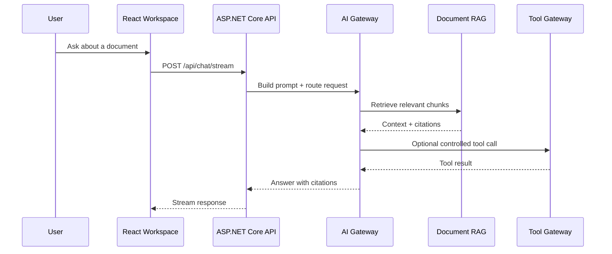

# Enterprise AI Document Assistant

A focused React + ASP.NET Core application for connecting the core building blocks of modern AI applications: assistant UI, prompt orchestration, AI Gateway, RAG, vector search, Tool Calling, MCP, simple workflow orchestration, and Microsoft Graph integration.

V1 is intentionally small: one end-to-end document assistant flow, implemented in clear steps.

---

## V1 Architecture



---

## V1 Flow



---

## V1 Modules

| Module | Purpose | First Scope |
|---|---|---|
| React Workspace | User-facing work area | Document list, document detail, right-side Assistant, citations, tool results |
| ASP.NET Core API | Backend boundary | `/api/chat`, `/api/documents`, `/api/tools`, `/api/workflows` |
| Prompt and AI Layer | Controlled model behavior | Prompt orchestration, structured output, validation, guardrails, AI Gateway |
| Tool Gateway and Skills | Controlled actions | `SearchDocumentsTool`, `GetDocumentMetadataTool`, `SummarySkill`, `RiskAnalysisSkill`, `EmailDraftSkill` |
| Document RAG | Source-grounded answers | Upload, parse, chunk, embed, vector search, citations |
| MCP / Harness / Workflow / Agent Orchestration | Extension path | MCP for existing tools, prompt/tool harnesses, one workflow, coordinator-to-agent orchestration, optional A2A handoff |

---

## Current Status

- [x] React Workspace skeleton
- [x] ASP.NET Core API skeleton
- [x] Backend-driven workspace data
- [x] Chat endpoint
- [x] Streaming chat response
- [x] Prompt orchestration
- [x] Structured output validation
- [x] Simple guardrails
- [x] Tool Gateway
- [x] First tools
- [x] MCP Server
- [x] Prompt and Tool Harness
- [x] SummarySkill
- [x] RiskAnalysisSkill
- [x] EmailDraftSkill
- [ ] Conversation Memory
- [ ] Simple Agent Planner
- [ ] Audit Logging
- [ ] AI Gateway
- [ ] Document Upload
- [ ] Text Parsing and Chunking
- [ ] Embeddings
- [ ] Vector Search
- [ ] RAG Answer with Citations
- [ ] Workflow
- [ ] Microsoft Graph Integration
- [ ] Agent Orchestration and A2A Extension

---

## Next Implementation Order

```text
Simple guardrails
  -> Tool Gateway
  -> First tool
  -> MCP Server
  -> Prompt and Tool Harness
  -> SummarySkill
  -> RiskAnalysisSkill
  -> EmailDraftSkill
  -> Conversation Memory
  -> Simple Agent Planner
  -> Audit logging
  -> AI Gateway
  -> Document RAG
  -> workflow
  -> Agent Orchestration and A2A extension
```

---

## Tech Stack

| Area | Stack |
|---|---|
| Frontend | React, TypeScript, Vite, Tailwind CSS |
| Backend | ASP.NET Core Web API |
| AI | OpenAI / Azure OpenAI, Semantic Kernel or Microsoft.Extensions.AI friendly design |
| Retrieval | Embeddings, vector store, source citations |
| Integration | Microsoft Graph, REST APIs, MCP |

---

## Local Development

```bash
git clone https://github.com/haoyucheng369-gif/enterprise-ai-document-assistant.git
cd enterprise-ai-document-assistant
```

Frontend:

```bash
cd frontend
npm install
npm run dev
```

---

## Documentation

- [Architecture](docs/architecture.md)
- [Roadmap](docs/roadmap.md)
- [Chinese README](README.zh-CN.md)

