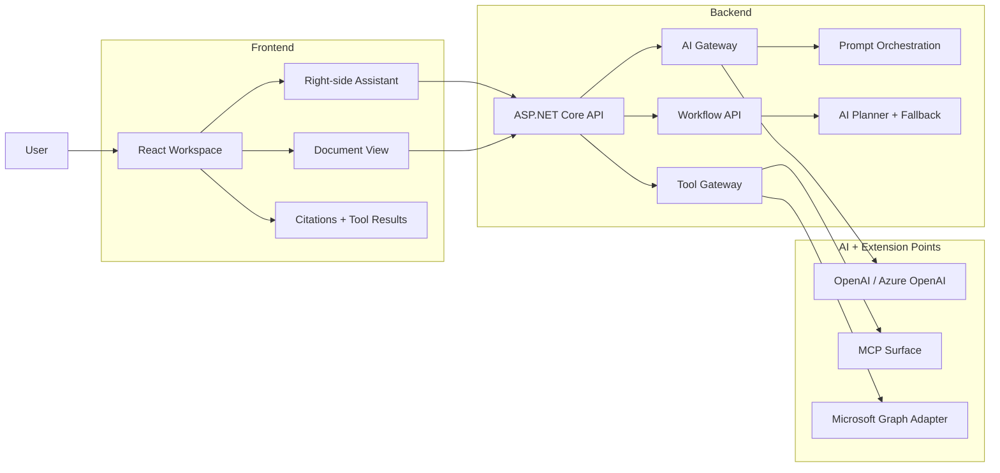
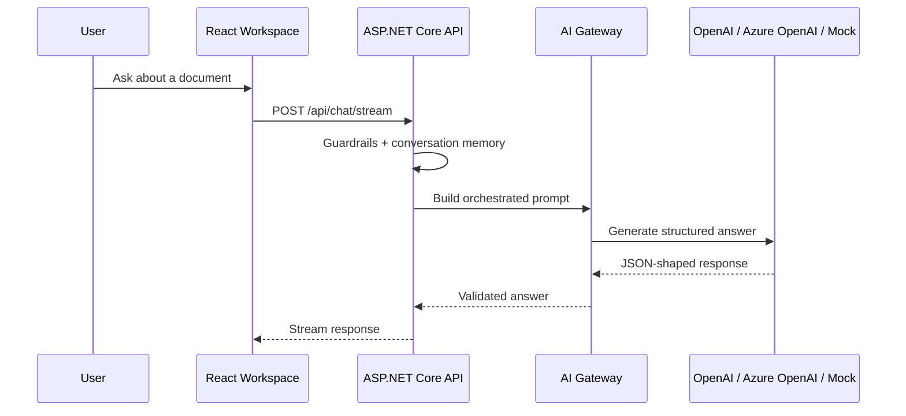

# Enterprise AI Document Assistant

A production-oriented React + ASP.NET Core application for connecting the core building blocks of modern AI applications: assistant UI, prompt orchestration, AI Gateway, document processing, controlled skills, Tool Gateway, MCP surface, and workflow orchestration.

V1 is intentionally small: one end-to-end document assistant flow, implemented in clear steps. Retrieval, vector search, persistence, and full enterprise integrations are staged after the core assistant path is understandable.

---

## V1 Architecture



---

## Current Core Flow



---

## V1 Modules

| Module | Purpose | First Scope |
|---|---|---|
| React Workspace | User-facing work area | Document list, document workspace tabs, right-side Assistant, citations, tool results |
| ASP.NET Core API | Backend boundary | `/api/chat`, `/api/documents`, `/api/tools`, `/api/workflows` |
| Prompt and AI Layer | Controlled model behavior | Prompt orchestration, structured output, validation, guardrails, AI Gateway |
| Tool Gateway and Skills | Controlled actions | `GetHealthStatusTool`, `GetDocumentMetadataTool`, `SummarySkill`, `RiskAnalysisSkill`, `EmailDraftSkill`, `ResumeReviewSkill` |
| Document Processing | Source document handling | Upload, parse, chunk, preview, document metadata |
| Persistence | Application state | Conversation history, document metadata, workflow records, audit/tool records; MongoDB remains optional |
| MCP / Harness / Workflow / Integration | Extension path | MCP wrapper over existing tools, prompt/tool harnesses, one workflow, Microsoft Graph adapter boundary |

---

## Current Status

### Completed Core

- [x] React workspace with document list, upload zone, document tabs, and right-side Assistant
- [x] ASP.NET Core controller API with Swagger, contracts, and ProblemDetails
- [x] Backend-driven workspace data and document upload flow
- [x] Text parsing, chunking, and document preview
- [x] Chat endpoint with prompt orchestration, conversation memory, structured output, and simple guardrails
- [x] AI Gateway with local mock, OpenAI, and Azure OpenAI provider selection
- [x] Skills: classification, summary, risk analysis, email draft, and resume review
- [x] Workflow: document summary -> risk analysis -> email draft
- [x] Tool Gateway with health and document metadata tools
- [x] MCP controller surface over registered tools
- [x] In-memory audit logging
- [x] AI intent routing through Agent Planner with deterministic fallback
- [x] Docker Compose MongoDB baseline

### Lightweight Boundaries

- [x] Microsoft Graph adapter scaffold with mock email draft output, not OAuth-backed real Graph calls
- [x] Prompt and tool harness checks for basic regression coverage

### Not Built Yet

- [ ] MongoDB persistence wired into conversation, document, workflow, and audit storage
- [ ] Embeddings
- [ ] Vector Search
- [ ] RAG Answer with Citations
- [ ] LLM-native function/tool calling loop
- [ ] Real Microsoft Graph OAuth integration
- [ ] No-answer Guardrail
- [ ] Basic document permission filtering

### Build Next

- [ ] Conversation and document storage with MongoDB or relational storage
- [ ] Embeddings
- [ ] Vector Search
- [ ] RAG Answer with Citations
- [ ] No-answer Guardrail
- [ ] Basic document permission filtering

### Build Lightly

- [ ] Rate limiting
- [ ] Observability and cost tracking
- [ ] Prompt versioning
- [ ] Sensitive data redaction for AI logs
- [ ] Expanded harness checks for prompts, skills, tools, and workflows
- [ ] Simple Agent Orchestration / A2A handoff

---

## Next Implementation Order

```text
Persistence
  -> Embeddings
  -> Vector Search
  -> RAG Answer with Citations
  -> No-answer Guardrail
  -> Basic Document Permission Filtering
  -> Rate Limiting
  -> Observability and Cost Tracking
  -> Prompt Versioning
  -> Sensitive Data Redaction
  -> Expanded Harness Checks
  -> Simple Agent Orchestration / A2A Handoff
```

`Build Next` items form the main delivery path. `Build Lightly` items stay intentionally small and are implemented only when they strengthen the application architecture.

### Deferred Scope

- Hybrid search and semantic ranking
- Real Microsoft Graph OAuth integration
- GraphQL API surface
- CI and deployment hardening

---

## Tech Stack

| Area | Stack |
|---|---|
| Frontend | React, TypeScript, Vite, Tailwind CSS |
| Backend | ASP.NET Core Web API |
| AI | OpenAI / Azure OpenAI, Semantic Kernel or Microsoft.Extensions.AI friendly design |
| Retrieval | Embeddings, vector store, source citations |
| Persistence | In-memory first, MongoDB or relational storage later |
| Integration | Microsoft Graph, REST APIs, MCP |

---

## Local Development

```bash
git clone https://github.com/haoyucheng369-gif/enterprise-ai-document-assistant.git
cd enterprise-ai-document-assistant
```

Frontend:

```bash
cd frontend
npm install
npm run dev
```

Backend local AI provider settings can be placed in:

```text
backend/src/EnterpriseAiDocumentAssistant.Api/appsettings.Local.json
```

Edit that local file with your provider, model, and API key. The local file is ignored by Git.

Local MongoDB can be started from the repository root:

```bash
docker compose up -d mongodb
docker compose ps
```

MongoDB Compass connection string:

```text
mongodb://localhost:27017
```

The database uses a Docker named volume, so data survives container restarts. Use `docker compose down -v` only when you intentionally want to remove the local database volume.

---

## Documentation

- [Architecture](docs/architecture.md)
- [Roadmap](docs/roadmap.md)
- [Chinese README](README.zh-CN.md)

