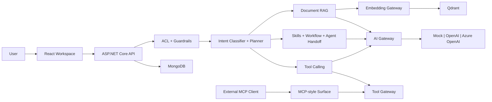
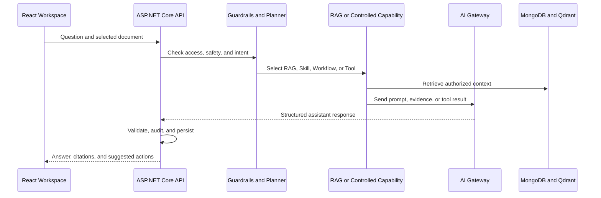

# Enterprise AI Document Assistant

A focused enterprise document intelligence application built with React and ASP.NET Core. It connects document ingestion, grounded AI assistance, controlled tool execution, agent handoff, and persistent application state through replaceable service boundaries.

The system supports local Mock execution as well as OpenAI and Azure OpenAI without coupling business workflows to a specific model provider.

## Architecture


```mermaid
flowchart LR
    user["User"] --> ui["React Workspace"]
    ui --> api["ASP.NET Core API"]

    api --> security["ACL + Guardrails"]
    security --> routing["Intent Classifier + Planner"]

    routing --> rag["Document RAG"]
    routing --> capabilities["Skills + Workflow + Agent Handoff"]
    routing --> calling["Tool Calling"]

    rag --> embedding["Embedding Gateway"]
    embedding --> qdrant["Qdrant"]
    rag --> gateway["AI Gateway"]
    capabilities --> gateway
    calling --> gateway
    calling --> tools["Tool Gateway"]

    gateway --> models["Mock | OpenAI | Azure OpenAI"]
    api --> mongo["MongoDB"]

    external["External MCP Client"] --> mcp["MCP-style Surface"]
    mcp --> tools
```

## Request Flow


```mermaid
sequenceDiagram
    participant UI as React Workspace
    participant API as ASP.NET Core API
    participant Route as Guardrails and Planner
    participant App as RAG or Controlled Capability
    participant AI as AI Gateway
    participant Data as MongoDB and Qdrant

    UI->>API: Question and selected document
    API->>Route: Check access, safety, and intent
    Route->>App: Select RAG, Skill, Workflow, or Tool
    App->>Data: Retrieve authorized context
    App->>AI: Send prompt, evidence, or tool result
    AI-->>API: Structured assistant response
    API->>API: Validate, audit, and persist
    API-->>UI: Answer, citations, and suggested actions
```

## Core Capabilities

**Document intelligence and grounded answers**

TXT, Markdown, PDF, and DOCX uploads are parsed into chunks, converted to embeddings, indexed in Qdrant, and retrieved with a configurable similarity threshold. The assistant sends matched source text rather than vectors to the model and returns traceable citations.

**Controlled AI orchestration**

Input guardrails run before intent classification. The Planner maps classified requests to known RAG, Skill, Workflow, or Tool routes. Structured model responses are validated before they reach the UI or conversation store.

**Reusable Skills and agent handoff**

Summary, risk analysis, classification, email drafting, and resume review are exposed through stable contracts. The document review workflow demonstrates a typed `DocumentAgentHandoff` from `DocumentAgent` to `EmailAgent` without introducing an open-ended autonomous loop.

**Tool and MCP interoperability**

The Tool Gateway registers and executes controlled backend capabilities. Native single-turn tool calling lets the model choose a read-only tool, while MCP-style `list` and `call` endpoints expose the same registered tools to external clients.

**Enterprise application controls**

MongoDB applies owner-reader ACL filtering before documents reach chat, RAG, Skills, or Tools. ASP.NET Core rate limiting, ProblemDetails, health checks, cancellation, structured audit events, and provider/token/latency records keep operational behavior visible.

## Technology

- **Frontend:** React, TypeScript, Vite, Tailwind CSS
- **Backend:** ASP.NET Core Web API, Controllers, dependency injection, Swagger, ProblemDetails
- **AI:** OpenAI-compatible chat and embedding APIs behind `IAiGateway` and `IEmbeddingGateway`
- **Data:** MongoDB for documents and conversations; Qdrant for persistent vector search
- **Infrastructure:** Docker Compose for local MongoDB and Qdrant

## Run Locally

Start infrastructure from the repository root:

```bash
docker compose up -d mongodb qdrant
```

Start the API:

```bash
cd backend
dotnet run --project src/EnterpriseAiDocumentAssistant.Api
```

Start the React workspace:

```bash
cd frontend
npm install
npm run dev
```

Provider settings and API keys belong in the Git-ignored file:

```text
backend/src/EnterpriseAiDocumentAssistant.Api/appsettings.Local.json
```

Local interfaces:

- React workspace: `http://localhost:5173`
- Swagger: `http://localhost:5221/swagger`
- Health check: `http://localhost:5221/health`
- MongoDB Compass: `mongodb://localhost:27017`
- Qdrant dashboard: `http://localhost:6333/dashboard`

For local ACL verification, the frontend sends `X-User-Id`. This development identity adapter is designed to be replaced by authenticated claims in a deployed environment.

## V1 Boundaries

The current MCP surface demonstrates tool discovery and execution through HTTP but is not a complete MCP SDK/JSON-RPC transport. Microsoft Graph uses a replaceable mock adapter, audit records remain in memory, and uploaded source binaries are not persisted. These boundaries are documented explicitly so production integrations can replace them without changing the core application flow.

## Documentation

- [Architecture](docs/architecture.md)
- [Roadmap and implementation status](docs/roadmap.md)
- [中文说明](README.zh-CN.md)
