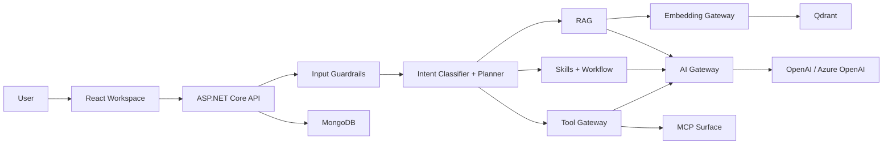
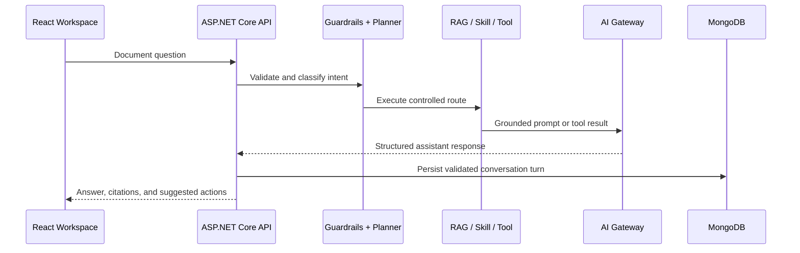

# Enterprise AI Document Assistant

An enterprise-oriented document intelligence workspace built with React and ASP.NET Core. It combines document ingestion, grounded AI assistance, controlled capability execution, and persistent application state behind clear service boundaries.

The solution demonstrates how common enterprise AI patterns fit into one coherent application without coupling business workflows directly to a model provider.

## Architecture


```mermaid
flowchart LR
    user[User] --> ui[React Workspace]
    ui --> api[ASP.NET Core API]

    api --> safety[Input Guardrails]
    safety --> planner[Intent Classifier + Planner]

    planner --> rag[RAG]
    planner --> skills[Skills + Workflow]
    planner --> tools[Tool Gateway]

    rag --> embeddings[Embedding Gateway]
    embeddings --> vectors[Qdrant]
    rag --> ai[AI Gateway]
    skills --> ai
    tools --> ai

    ai --> models[OpenAI / Azure OpenAI]
    api --> mongo[MongoDB]
    tools --> mcp[MCP Surface]
```

## Solution Scope

| Area | Implementation |
|---|---|
| Document workspace | Upload, parsing, chunk preview, classification, workflow results, citations, and tool output |
| AI application layer | Prompt orchestration, structured responses, input guardrails, validation, and provider routing |
| Grounded assistance | Embeddings, semantic retrieval, Qdrant or in-memory vectors, similarity threshold, and source citations |
| Controlled capabilities | Skills, document workflow, Agent Planner, Tool Gateway, native tool calling, and MCP exposure |
| Persistence and access | MongoDB records, owner-reader ACL filtering, per-user AI rate limiting, and Qdrant vector indexes |
| Operations | Structured audit events and an AI execution view for provider, model, tokens, latency, user, and outcome |

## Request Flow


```mermaid
sequenceDiagram
    participant UI as React Workspace
    participant API as ASP.NET Core API
    participant Plan as Guardrails + Planner
    participant Capability as RAG / Skill / Tool
    participant AI as AI Gateway
    participant DB as MongoDB

    UI->>API: Document question
    API->>Plan: Validate and classify intent
    Plan->>Capability: Execute controlled route
    Capability->>AI: Grounded prompt or tool result
    AI-->>API: Structured assistant response
    API->>DB: Persist validated conversation turn
    API-->>UI: Answer, citations, and suggested actions
```

## Technology

- React, TypeScript, Vite, Tailwind CSS
- ASP.NET Core Web API, controllers, dependency injection, Swagger, ProblemDetails
- OpenAI and Azure OpenAI behind an AI Gateway abstraction
- MongoDB for document and conversation records
- Qdrant for persistent vector search
- Docker Compose for local infrastructure

## Run Locally

Start MongoDB and Qdrant from the repository root:

```bash
docker compose up -d mongodb qdrant
```

Start the API:

```bash
cd backend
dotnet run --project src/EnterpriseAiDocumentAssistant.Api
```

Start the React workspace:

```bash
cd frontend
npm install
npm run dev
```

Local provider credentials belong in the Git-ignored file:

```text
backend/src/EnterpriseAiDocumentAssistant.Api/appsettings.Local.json
```

For local ACL testing, requests may include `X-User-Id`; omitting it uses `local-user`. This header is a development identity adapter, not a replacement for authenticated claims in a deployed environment.

Operational interfaces:

- Swagger: `http://localhost:5221/swagger`
- MongoDB Compass: `mongodb://localhost:27017`
- Qdrant dashboard: `http://localhost:6333/dashboard`

## Direction

The current application covers the main document-assistant flow from ingestion through permission-filtered retrieval, controlled execution, structured response, and persistence. Remaining extensions are intentionally limited to concise observability and a lightweight agent handoff.

Detailed design and implementation order:

- [Architecture](docs/architecture.md)
- [Roadmap](docs/roadmap.md)
- [中文说明](README.zh-CN.md)
