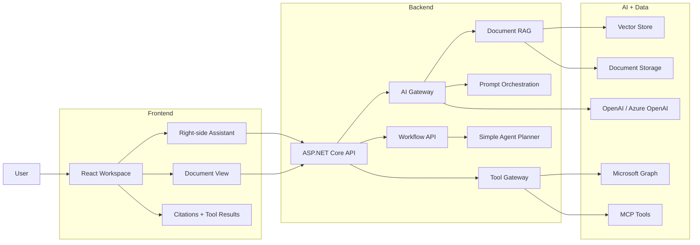
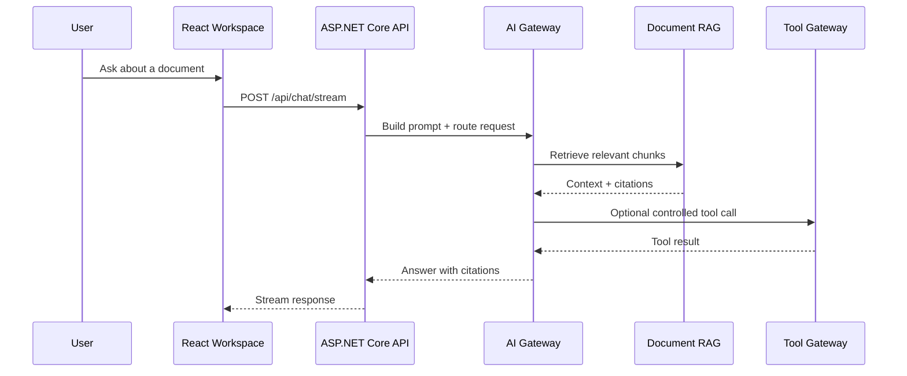

# Enterprise AI Document Assistant

一个面向生产场景的 React + ASP.NET Core AI 文档助手应用，用来串起现代 AI 应用开发的核心模块：Assistant UI、Prompt Orchestration、AI Gateway、RAG、Vector Search、Tool Calling、MCP、简单工作流编排和 Microsoft Graph 集成。

V1 保持小而完整：先跑通一条端到端文档助手主线，再逐步加深。

---

## V1 架构



---

## V1 流程



---

## V1 模块

| 模块 | 作用 | 第一版范围 |
|---|---|---|
| React Workspace | 用户工作区 | 文档列表、文档详情、右侧 Assistant、来源引用、工具结果 |
| ASP.NET Core API | 后端边界 | `/api/chat`、`/api/documents`、`/api/tools`、`/api/workflows` |
| Prompt and AI Layer | Prompt / AI 控制层 | Prompt Orchestration、Structured Output、Validation、Guardrails、AI Gateway |
| Tool Gateway and Skills | 受控工具执行 | `SearchDocumentsTool`、`GetDocumentMetadataTool`、`SummarySkill`、`RiskAnalysisSkill`、`EmailDraftSkill` |
| Document RAG | 基于来源的回答 | Upload、Parse、Chunk、Embed、Vector Search、Citations |
| MCP / Harness / Workflow / Agent Orchestration | 扩展路径 | MCP 暴露已有 Tool、Prompt/Tool Harness、一个 Workflow、协调者调度 Agent、可选 A2A 交接 |

---

## 当前状态

- [x] React Workspace skeleton
- [x] ASP.NET Core API skeleton
- [x] Backend-driven workspace data
- [x] Chat endpoint
- [x] Streaming chat response
- [x] Prompt orchestration
- [x] Structured output validation
- [x] Simple guardrails
- [x] Tool Gateway
- [x] First tools
- [x] MCP Server
- [x] Prompt and Tool Harness
- [x] SummarySkill
- [x] RiskAnalysisSkill
- [x] EmailDraftSkill
- [x] Conversation Memory
- [x] Simple Agent Planner
- [x] Audit Logging
- [ ] AI Gateway
- [ ] Document Upload
- [ ] Text Parsing and Chunking
- [ ] Embeddings
- [ ] Vector Search
- [ ] RAG Answer with Citations
- [ ] Workflow
- [ ] Microsoft Graph Integration
- [ ] Agent Orchestration and A2A Extension

---

## Next Implementation Order

```text
Simple guardrails
  -> Tool Gateway
  -> First tool
  -> MCP Server
  -> Prompt and Tool Harness
  -> SummarySkill
  -> RiskAnalysisSkill
  -> EmailDraftSkill
  -> Conversation Memory
  -> Simple Agent Planner
  -> Audit logging
  -> AI Gateway
  -> Document Upload
  -> Text Parsing and Chunking
  -> Embeddings
  -> Vector Search
  -> RAG Answer with Citations
  -> Workflow
  -> Microsoft Graph Integration
  -> Agent Orchestration and A2A Extension
```

---

## 技术栈

| 领域 | 技术 |
|---|---|
| Frontend | React、TypeScript、Vite、Tailwind CSS |
| Backend | ASP.NET Core Web API |
| AI | OpenAI / Azure OpenAI，适配 Semantic Kernel 或 Microsoft.Extensions.AI 的设计 |
| Retrieval | Embeddings、Vector Store、Source Citations |
| Integration | Microsoft Graph、REST APIs、MCP |

---

## 本地开发

```bash
git clone https://github.com/haoyucheng369-gif/enterprise-ai-document-assistant.git
cd enterprise-ai-document-assistant
```

Frontend:

```bash
cd frontend
npm install
npm run dev
```

---

## 文档

- [Architecture](docs/architecture.md)
- [Roadmap](docs/roadmap.md)
- [English README](README.md)
