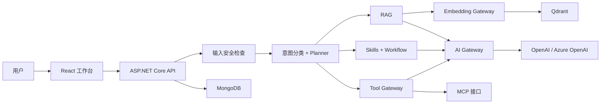
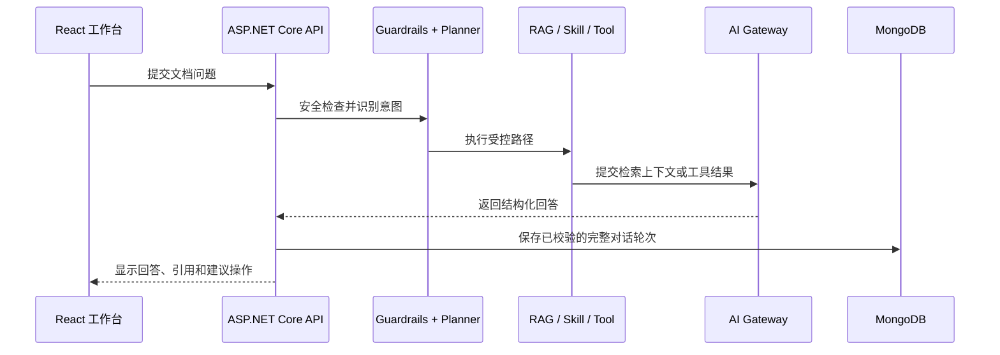

# Enterprise AI Document Assistant

一个基于 React 与 ASP.NET Core 的企业 AI 文档工作台。系统将文档处理、可信问答、受控能力调用和应用数据持久化组织在清晰的服务边界内。

项目重点展示常见企业 AI 模式如何组成一条完整主线，同时避免业务流程直接依赖某一家模型供应商。

## 架构


```mermaid
flowchart LR
    user[用户] --> ui[React 工作台]
    ui --> api[ASP.NET Core API]

    api --> safety[输入安全检查]
    safety --> planner[意图分类 + Planner]

    planner --> rag[RAG]
    planner --> skills[Skills + Workflow]
    planner --> tools[Tool Gateway]

    rag --> embeddings[Embedding Gateway]
    embeddings --> vectors[Qdrant]
    rag --> ai[AI Gateway]
    skills --> ai
    tools --> ai

    ai --> models[OpenAI / Azure OpenAI]
    api --> mongo[MongoDB]
    tools --> mcp[MCP 接口]
```

## 解决方案范围

| 模块 | 当前实现 |
|---|---|
| 文档工作台 | 上传、解析、分块预览、分类、工作流结果、引用和工具结果 |
| AI 应用层 | Prompt 编排、结构化输出、输入安全检查、结果校验和模型路由 |
| 可信问答 | Embedding、语义检索、Qdrant 或内存向量、相似度阈值和来源引用 |
| 受控能力 | Skills、文档工作流、Agent Planner、Tool Gateway、Tool Calling 和 MCP |
| 持久化与权限 | MongoDB 记录、Owner/Reader ACL 过滤、按用户的 AI 限流、Qdrant 向量索引 |
| 运行信息 | 结构化审计事件，以及 Provider、模型、Token、耗时、用户和结果的 AI 调用视图 |

## 请求主线


```mermaid
sequenceDiagram
    participant UI as React 工作台
    participant API as ASP.NET Core API
    participant Plan as Guardrails + Planner
    participant Capability as RAG / Skill / Tool
    participant AI as AI Gateway
    participant DB as MongoDB

    UI->>API: 提交文档问题
    API->>Plan: 安全检查并识别意图
    Plan->>Capability: 执行受控路径
    Capability->>AI: 提交检索上下文或工具结果
    AI-->>API: 返回结构化回答
    API->>DB: 保存已校验的完整对话轮次
    API-->>UI: 显示回答、引用和建议操作
```

## 技术栈

- React、TypeScript、Vite、Tailwind CSS
- ASP.NET Core Web API、Controllers、依赖注入、Swagger、ProblemDetails
- OpenAI 与 Azure OpenAI，通过 AI Gateway 隔离供应商实现
- MongoDB 保存文档和对话记录
- Qdrant 提供持久化向量检索
- Docker Compose 启动本地基础设施

## 本地运行

在仓库根目录启动 MongoDB 和 Qdrant：

```bash
docker compose up -d mongodb qdrant
```

启动 API：

```bash
cd backend
dotnet run --project src/EnterpriseAiDocumentAssistant.Api
```

启动 React 工作台：

```bash
cd frontend
npm install
npm run dev
```

本地模型配置和密钥放在 Git 已忽略的文件中：

```text
backend/src/EnterpriseAiDocumentAssistant.Api/appsettings.Local.json
```

本地 ACL 测试可以通过 `X-User-Id` 指定用户；不传时使用 `local-user`。这个 Header 只是开发环境身份适配器，部署时应替换为认证后的用户 Claims。

常用入口：

- Swagger：`http://localhost:5221/swagger`
- MongoDB Compass：`mongodb://localhost:27017`
- Qdrant Dashboard：`http://localhost:6333/dashboard`

## 后续方向

当前应用已经覆盖从文档接入、权限过滤检索、受控能力执行、结构化回答到持久化的完整主线。后续扩展只保留精简的可观测性和轻量 Agent 交接。

详细设计与实现顺序：

- [架构说明](docs/architecture.md)
- [路线图](docs/roadmap.md)
- [English README](README.md)
