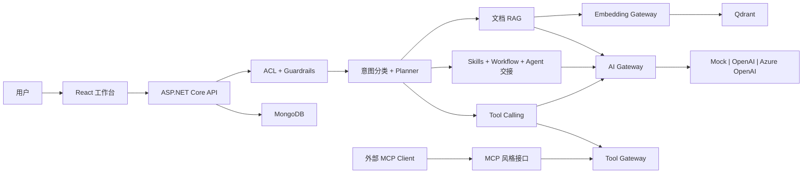
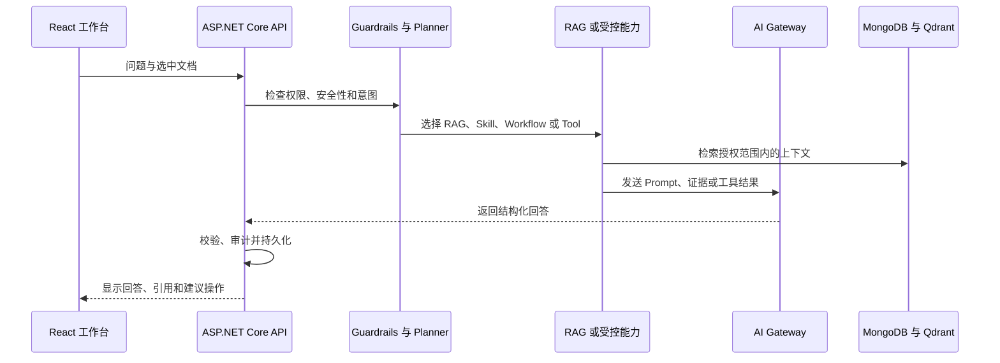

# Enterprise AI Document Assistant

一个基于 React 与 ASP.NET Core 的企业文档智能应用。系统通过可替换的服务边界，将文档接入、可信 AI 问答、受控工具执行、Agent 交接和应用状态持久化连接成完整主线。

系统同时支持本地 Mock、OpenAI 和 Azure OpenAI，业务流程不直接依赖特定模型供应商。

## 架构


```mermaid
flowchart LR
    user["用户"] --> ui["React 工作台"]
    ui --> api["ASP.NET Core API"]

    api --> security["ACL + Guardrails"]
    security --> routing["意图分类 + Planner"]

    routing --> rag["文档 RAG"]
    routing --> capabilities["Skills + Workflow + Agent 交接"]
    routing --> calling["Tool Calling"]

    rag --> embedding["Embedding Gateway"]
    embedding --> qdrant["Qdrant"]
    rag --> gateway["AI Gateway"]
    capabilities --> gateway
    calling --> gateway
    calling --> tools["Tool Gateway"]

    gateway --> models["Mock | OpenAI | Azure OpenAI"]
    api --> mongo["MongoDB"]

    external["外部 MCP Client"] --> mcp["MCP 风格接口"]
    mcp --> tools
```

## 请求主线


```mermaid
sequenceDiagram
    participant UI as React 工作台
    participant API as ASP.NET Core API
    participant Route as Guardrails 与 Planner
    participant App as RAG 或受控能力
    participant AI as AI Gateway
    participant Data as MongoDB 与 Qdrant

    UI->>API: 问题与选中文档
    API->>Route: 检查权限、安全性和意图
    Route->>App: 选择 RAG、Skill、Workflow 或 Tool
    App->>Data: 检索授权范围内的上下文
    App->>AI: 发送 Prompt、证据或工具结果
    AI-->>API: 返回结构化回答
    API->>API: 校验、审计并持久化
    API-->>UI: 显示回答、引用和建议操作
```

## 核心能力

**文档智能与可信回答**

系统支持 TXT、Markdown、PDF 和 DOCX。上传内容经过解析、分块和 Embedding 后写入 Qdrant，并通过可配置的相似度阈值检索。发送给模型的是匹配到的原文，而不是向量，最终回答包含可追踪的 Citation。

**受控 AI 编排**

输入首先经过 Guardrails，再进行意图分类。Planner 只会选择已知的 RAG、Skill、Workflow 或 Tool 路径；模型返回的结构化结果经过校验后，才进入前端和对话存储。

**可复用 Skills 与 Agent 交接**

摘要、风险分析、文档分类、邮件生成和简历评估均使用稳定 Contract。文档审查流程通过类型化的 `DocumentAgentHandoff`，将 `DocumentAgent` 的结果交给 `EmailAgent`，不引入开放式自主循环。

**Tool 与 MCP 互操作**

Tool Gateway 统一注册和执行受控后端能力。单轮 Tool Calling 允许模型选择只读工具；MCP 风格的 `list` 和 `call` 接口则把同一组工具暴露给外部 Client。

**企业应用控制**

MongoDB 在文档进入 Chat、RAG、Skill 或 Tool 前执行 Owner/Reader ACL 过滤。ASP.NET Core 限流、ProblemDetails、健康检查、取消请求、结构化审计，以及 Provider、Token 和耗时记录，使运行状态可检查。

## 技术栈

- **前端：** React、TypeScript、Vite、Tailwind CSS
- **后端：** ASP.NET Core Web API、Controllers、依赖注入、Swagger、ProblemDetails
- **AI：** 通过 `IAiGateway` 与 `IEmbeddingGateway` 接入 OpenAI 兼容的对话和 Embedding API
- **数据：** MongoDB 保存文档与对话；Qdrant 提供持久化向量检索
- **基础设施：** Docker Compose 启动本地 MongoDB 与 Qdrant

## 本地运行

在仓库根目录启动基础设施：

```bash
docker compose up -d mongodb qdrant
```

启动 API：

```bash
cd backend
dotnet run --project src/EnterpriseAiDocumentAssistant.Api
```

启动 React 工作台：

```bash
cd frontend
npm install
npm run dev
```

模型配置和 API Key 放在 Git 已忽略的文件中：

```text
backend/src/EnterpriseAiDocumentAssistant.Api/appsettings.Local.json
```

本地入口：

- React 工作台：`http://localhost:5173`
- Swagger：`http://localhost:5221/swagger`
- Health Check：`http://localhost:5221/health`
- MongoDB Compass：`mongodb://localhost:27017`
- Qdrant Dashboard：`http://localhost:6333/dashboard`

本地 ACL 测试通过 `X-User-Id` 传递身份。这个开发环境适配器在部署时应替换为认证后的 Claims。

## V1 边界

当前 MCP 接口用于展示基于 HTTP 的工具发现与执行，并不是完整 MCP SDK/JSON-RPC Transport。Microsoft Graph 使用可替换的 Mock Adapter，审计记录暂存在内存，上传的原始文件也尚未持久化。这些边界被明确隔离，后续可以替换基础设施而不改变应用主流程。

## 文档

- [架构说明](docs/architecture.md)
- [路线图与实现状态](docs/roadmap.md)
- [English README](README.md)
